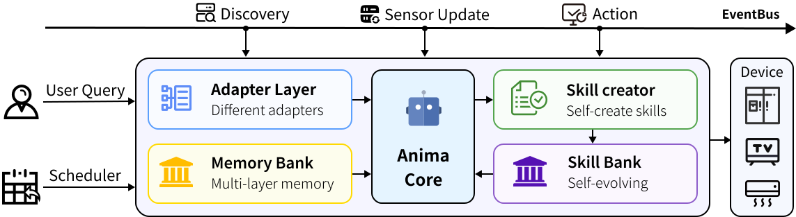

<div align="center">
  
  <h1></h1>
  <p><strong>Make every hardware intelligent</strong></p>
  <p>An open-source Agent OS for hardware intelligence.</p>

  [English](./README.md) | [中文](./README.zh-CN.md)
  <br/><br/>

  [](./LICENSE)
  
  
  
  
  
</div>

<br/>

**Anima** 是一个面向智能硬件的开源 Agent OS。它的目标不是再做一个设备控制面板，而是让家中的硬件设备拥有可感知、可决策、可学习、可扩展的 AI 能力。

名字 **Anima** 起源于拉丁语，意为“灵魂”。这个名字也正对应了项目最初的想法：今天的智能硬件已经有传感器、联网能力和执行能力，但它们大多数仍然停留在“等待命令”的阶段。Anima 想做的是给这些硬件接上一套可运行的智能中枢，让灯、空调、加湿器、空气净化器、音箱以及未来更多设备，不只是被控制，而是能理解环境、理解用户、理解彼此。

> Anima 的愿景：把每一台硬件从“可联网设备”推进到“可协作的智能体”。

<div align="center">
  
</div>

## Anima 是什么

Anima 可以理解为运行在你本地网络中的智能硬件 Agent Runtime：

- 它会发现设备，维护设备状态，并通过 adapter 控制真实硬件。
- 它维护长期 Memory，从明确偏好和重复行为中学习。
- 它借助 LLM Brain 读取环境、用户意图、历史记忆和 skill 知识，然后规划行动。
- 它将每类设备的专业知识封装成 Skill，让决策不只是“开/关”，而是符合场景、舒适度和安全边界。
- 它提供 Dashboard、REST API 和 CLI，让你可以观察、调试、控制和扩展整个系统。

Anima目前适配了Mi home/miot设备，后续会增添新的硬件设备协议，也欢迎开源社区的朋友们做出贡献

---

## 为什么做 Anima

<div align="center">


</div>

> [!TIP]
> 大多数智能家居系统问的是"你需要什么传感器？"Anima 问的是 **"你有什么——我来用。"** 它自动发现你的设备，为每台设备加载领域知识，从第一天起就开始做智能决策。

<details>
<summary><strong>Q：需要手动配置设备吗？</strong></summary>

**A：** 不需要。Anima 通过相应的适配器协议自动扫描局域网发现设备。对于小米/米家设备，一次扫码即可自动获取所有 Token——无需手动填写 IP 列表或提取 Token。

</details>

<details>
<summary><strong>Q：它只是个花哨的开关控制器吗？</strong></summary>

**A：** 远不止如此。核心设备类型都有专属的 **技能（Skill）**——一个包含舒适度模型、占用感知、跨设备协调规则和偏好学习的领域知识包。你的加湿器了解季节调整和空调联动；你的灯光会自动遵循昼夜节律。

</details>

<details>
<summary><strong>Q：它怎么学习我的偏好？</strong></summary>

**A：** Anima 维护着一套包含 `preferences.md`、各设备类型规范化 learned profile 和提取 topic memories 的记忆系统。Brain 会从你的交互历史中增量提取偏好，并随时间演进行为。

</details>

<details>
<summary><strong>Q：支持哪些 LLM 提供商？</strong></summary>

**A：** 任何兼容 OpenAI API 的服务——包括 OpenAI、DeepSeek、豆包、Anthropic（通过代理）以及本地 Ollama 模型。只需设置 `ANIMA_LLM_API_KEY`，可选设置 `ANIMA_LLM_BASE_URL`。

</details>

---

## 系统架构

Anima 的整体运行链路由用户请求、设备发现、传感器更新、定时任务和设备动作共同驱动。信号进入 Anima Core 后，Brain 结合设备状态、Memory 与 Skill 上下文完成理解和规划；执行阶段再由 Skill 将决策转化为结构化动作，并通过 Adapter 映射到具体硬件协议，完成真实设备控制与反馈记录。

<div align="center">
  
</div>

---


## 核心亮点

### 1. Brain：中枢决策层

Brain 是 Anima 的智能中枢。它负责把用户对话、设备状态、环境信号、记忆和 skill 能力合并起来，生成可执行计划。

当前 Brain 支持：

- 基于 LangGraph 的 planner / executor 流程
- 统一聊天入口 `/api/chat`
- 定时 brain tick，用于主动环境检查和自动化决策
- skill 执行前的上下文构建
- 动作执行后的状态验证和 history 写入
- OpenAI-compatible LLM 后端

Brain 的目标不是让 LLM 随意控制设备，而是让它在明确的技能边界、设备能力和安全规则内做决策。

### 2. Skill：设备智能的最小单元

Anima 中的 Skill 不是一个简单函数，也不是普通 prompt。它是一个设备领域知识包，通常包含：

```text
SKILL.md              # skill 元信息、适用设备和工作规则
references/
  knowledge.md        # 领域知识
  decide.md           # 单次决策 prompt
  learn.md            # 长期学习 prompt
scripts/
  actions.py          # 结构化动作执行入口
```

内置 Skill 包括：

| Skill | 作用 |
|---|---|
| `light` | 灯光控制、亮度、色温、昼夜节律 |
| `humidifier` | 湿度舒适区间、季节因素、空调联动 |
| `air_conditioner` | 温度控制、舒适度和能耗平衡 |
| `air_purifier` | 空气质量、净化模式、睡眠安静策略 |
| `speaker` | 音频播放、停止播放、安静时段保护 |
| `coordinator` | 跨设备协同 |
| `device_discovery` | 设备发现、米家扫码、设备激活 |
| `skill_creator` | 根据自然语言需求生成自定义 skill |

你也可以在 `skills/custom/` 下添加自己的 skill，让 Anima 学会新的设备行为或家庭工作流。

下图展示了 Skill 在 Anima 中的完整生命周期：设备能力可以通过自动发现或用户定义进入 Skill Creator，随后被整理进 Skill Bank，供 Brain 在规划时检索和选择。执行阶段，Planner 会根据当前环境、设备状态和 Memory 上下文选择合适的 Skill；Skill 再把高层目标转成结构化动作，并通过 Adapter 落到真实设备。执行结果会回流到 Memory 和 learned profile，让后续决策更贴近用户习惯。

<div align="center">
  
</div>

这意味着 Anima 中的 Skill 不是一次性的函数调用，而是一个可以被创建、注册、检索、执行和反馈学习的设备智能单元。新增设备类型时，优先扩展 Skill，而不是把设备策略硬编码进 Brain 或 Adapter。

### 3. Memory：可证据化的长期记忆

Anima 的 Memory 系统采用分层设计：

```text
L1 Core Identity
  每次请求都加载的极简偏好摘要，例如 preferences_summary。

L2 Memory Directory
  给 planner 看的记忆目录，例如有哪些 learned profile 和 memory topic。

L3 Memory Detail
  skill 执行前按设备类型和任务检索的详细长期记忆。
```

下图对应了 Memory 在 Anima 运行时中的位置：底层文件负责保存偏好、历史、学习画像和 topic memories；中间的 Memory service 负责读取、提取、合并与更新；上层则通过 `get_planner_context()` 和 `get_skill_context(device_type)` 把不同粒度的记忆交给 Brain 和 Skill。这样 Planner 不需要每次读取所有历史，只需要先知道“有哪些记忆可用”，再在真正执行设备 Skill 时按需加载细节。

<div align="center">
  
</div>

这套分层设计让 Anima 可以同时兼顾长期学习和上下文控制：L1 保持轻量、L2 提供目录、L3 只在需要时加载确认过的详细记忆。执行结果、用户对话和设备状态会持续进入 history，并在后台被提取为更稳定的长期记忆，最终影响后续的设备决策。

当前 memory 系统已经支持：

- `history.json` 为每条交互生成 `event_id`
- extracted memory 使用标准 schema 存储
- `claim_type` 区分明确偏好、隐式偏好、例行行为、设备别名、约束和家庭上下文
- `positive_evidence` / `negative_evidence` 记录证据来源
- `status` 区分 `candidate`、`confirmed`、`rejected`、`stale`
- 只有 confirmed memory 默认进入 skill 决策
- learned profile 按设备类型保存到 `learned.json`


### 4. Adapter：真实硬件接入层

Adapter 负责把 Anima 的结构化动作转成真实设备协议。

当前主要支持：

- Xiaomi / Mi Home / MIoT 设备发现
- 小米云扫码获取设备列表和 token
- 本地 `ip + token` 控制普通 MIoT 设备
- Xiaomi speaker 的部分云端播放能力
- 手动添加 MIoT 设备
- 设备状态刷新和动作执行结果返回

需要注意：普通 MIoT 设备执行命令时，本质仍依赖设备当前可达的局域网 IP 和 token。小米云登录主要用于发现设备和获取 token，不等于所有设备都支持云端远程控制。

## 功能特性

- **自动发现设备**：局域网扫描、小米云设备同步、设备去重和运行时注册。
- **AI 决策中枢**：LLM Brain 根据环境、设备、skill 和 memory 生成行动计划。
- **可扩展 Skill 系统**：每个设备类型都有独立知识、决策、学习和动作脚本。
- **长期记忆机制**：从 history 中提取候选记忆，按证据晋升为 confirmed memory。
- **偏好学习**：按设备类型生成 learned profile，让后续决策更贴近用户习惯。
- **实时 Dashboard**：设备列表、环境状态、聊天控制、设置、memory 调试。
- **REST API**：提供设备、聊天、设置、扫描、memory 等接口。
- **MIoT 支持**：支持 Xiaomi / Mi Home 设备 token 获取、本地控制和部分音箱云端能力。
- **本地优先**：核心运行在你的机器上，设备控制尽量通过局域网完成。

---

## 快速开始 quick start

### 环境要求

- Node.js >= 18
- pnpm >= 8
- Python >= 3.11
- uv

`pnpm install` 会通过 `uv sync` 安装 Python 依赖。
要控制 MIoT 设备，请执行 uv sync --extra dev --extra miot --python 3.13，或把 postinstall 改成包含 miot

### 安装并运行

```bash
git clone https://github.com/fulai-tech/Anima.git
cd Anima
pnpm install
pnpm dev
```

启动后访问：

```text
Dashboard: http://localhost:3000
Backend API: http://localhost:8080
Swagger: http://localhost:8080/docs
```

### 配置 LLM

你可以在 `.env` 中配置，也可以在 Dashboard 设置页配置。

```env
ANIMA_LLM_API_KEY=sk-xxx
ANIMA_LLM_MODEL=gpt-4o
ANIMA_LLM_BASE_URL=
ANIMA_LLM_DISABLE_THINKING=false
```

Anima 使用 OpenAI-compatible API，因此可以接入 OpenAI、DeepSeek、豆包、Ollama 兼容端点或其他代理服务。

### 连接小米设备

推荐方式是在 Dashboard 中使用小米扫码登录：

1. 打开 Dashboard 设置页。
2. 进入 Xiaomi / Mi Home 配置区域。
3. 生成二维码。
4. 使用米家 App 扫码。
5. 在 Xiaomi Cloud 返回 token 的情况下自动同步；未返回 token 的设备仍可手动输入 token 激活

如果你已经知道设备 IP 和 token，也可以手动添加 MIoT 设备。

---

## 常用命令

| 命令 | 说明 |
|---|---|
| `pnpm install` | 安装前端和后端依赖 |
| `pnpm dev` | 同时启动 Dashboard、Backend 和本地 broker |
| `pnpm dev:frontend` | 仅启动前端 |
| `pnpm dev:backend` | 仅启动后端 |
| `pnpm dev:broker` | 仅启动本地 MQTT broker |
| `pnpm build` | 构建前端 |
| `uv run pytest tests/ -v` | 运行测试 |
| `uv run ruff check .` | 运行 Python lint |

---

## 项目结构

```text
Anima/
├── core/
│   ├── api/                 # FastAPI routes
│   ├── brain/               # Brain, planner, executor, ReAct agent, skill loader
│   ├── devices/             # Discovery orchestrator
│   ├── events/              # Async EventBus
│   ├── llm/                 # LLM runtime config
│   ├── media/               # Xiaomi speaker playback support
│   ├── memory/              # Preferences, history, learned profiles, extracted memories
│   ├── runtime/             # Settings and persisted config
│   └── main.py              # Application entrypoint
├── adapters/
│   └── miot/                # Xiaomi MIoT adapter
├── skills/
│   ├── system/              # Built-in skills
│   └── custom/              # User-defined skills
├── dashboard/               # React + Vite dashboard
├── tests/                   # Automated tests
├── docs/                    # Design notes and implementation plans
├── data/                    # Local runtime data
├── package.json             # Root pnpm scripts
└── pyproject.toml           # Python project config
```

---

## API 概览

后端默认运行在 `http://localhost:8080`。

常用接口包括：

| Method | Endpoint | 说明 |
|---|---|---|
| `GET` | `/health` | 健康检查 |
| `GET` | `/api/devices` | 获取设备列表 |
| `POST` | `/api/devices/{device_id}/command` | 向设备发送命令 |
| `POST` | `/api/devices/add` | 手动添加 MIoT 设备 |
| `POST` | `/api/devices/{device_id}/activate` | 用 token 激活扫描到的设备 |
| `POST` | `/api/chat` | 统一聊天与任务执行入口 |
| `GET` | `/api/environment` | 当前环境聚合状态 |
| `POST` | `/api/environment/refresh` | 刷新设备状态 |
| `POST` | `/api/scan` | 触发设备扫描 |
| `GET` | `/api/memory` | 查看 memory、history、learned profile |
| `GET` | `/api/settings` | 读取设置 |
| `POST` | `/api/settings/llm/configure` | 配置 LLM |
| `POST` | `/api/settings/xiaomi/qr/start` | 开始小米扫码登录 |
| `POST` | `/api/settings/xiaomi/qr/poll` | 轮询扫码状态 |

完整接口可以查看 Swagger：

```text
http://localhost:8080/docs
```

---

## 如何扩展

### 添加一个 Skill

最简单的扩展方式是新增 skill。

```text
skills/custom/my_skill/
├── SKILL.md
├── references/
│   ├── knowledge.md
│   ├── decide.md
│   └── learn.md
└── scripts/
    └── actions.py
```

一个好的 skill 应该回答四个问题：

```text
1. 它适用于哪些设备或场景？
2. 它需要哪些领域知识？
3. 它在什么情况下应该行动，什么情况下应该 no-op？
4. 它能输出哪些结构化动作？
```

### 添加一个 Adapter

Adapter 用来接入新的硬件协议。核心接口很小：

```text
discover()   # 发现设备
subscribe()  # 刷新或订阅状态
execute()    # 执行动作
```

你可以参考 `adapters/miot/` 实现新的协议适配器，例如 Matter、Home Assistant、BLE、HTTP API 或私有设备协议。

---

## 当前状态

Anima 仍处于早期版本，但已经具备完整可运行的核心闭环：

```text
设备发现 -> Brain 规划 -> Skill 决策 -> Adapter 执行 -> 状态验证 -> History/Memory 学习
```

当前更成熟的部分：

- Core runtime
- Dashboard
- MIoT adapter
- Skill framework
- Memory extraction and learned profile
- Chat and REST API

仍在持续演进的方向：

- 更多设备协议 adapter
- 更完善的远程控制策略
- 更强的 memory 检索和冲突处理
- Skill marketplace / community skills
- 多用户和权限模型
- 更完整的安全策略和部署体验

---

## 重大更新

这里会记录 Anima 的版本发布、架构升级和关键能力演进，方便开发者快速了解项目每个阶段的核心变化。

### 2026-06-01：Anima 正式开源

Anima 首个开源版本发布，提供面向智能硬件的 Agent OS 基础能力：本地设备发现、MIoT 设备接入、LLM Brain 决策、Skill 机制、长期 Memory 系统和可视化 Dashboard。

---

## 贡献

Anima 欢迎不同类型的贡献：

- 新增设备 adapter
- 编写或改进 skill
- 优化 Brain 决策流
- 改进 Memory 机制
- 增强 Dashboard 体验
- 补充测试和文档
- 报告真实设备兼容性问题

开始贡献前可以阅读：

- [CONTRIBUTING.md](./CONTRIBUTING.md)
- [ARCHITECTURE_GUARDRAILS.md](./ARCHITECTURE_GUARDRAILS.md)
- [docs/plans/design.md](./docs/plans/design.md)

---

## 安全说明

Anima 会连接真实设备并执行真实动作。请注意：

- 不要把 Dashboard 或 API 直接暴露到公网。
- 小米 token、LLM API key 等敏感信息应只保存在可信环境。
- 控制公司、公共空间或多人共享空间设备时，应先建立明确权限边界。
- 对自动化行为保持保守，尤其是涉及门锁、安防、电器电源等高风险设备时。

---

## License

This project is licensed under the Apache License 2.0.
See the [LICENSE](./LICENSE) file for details.

<div align="center">
  <br/>
  <p><em><strong>Anima</strong></em></p>
  <p><em>Make every hardware intelligent.</em></p>
</div>
