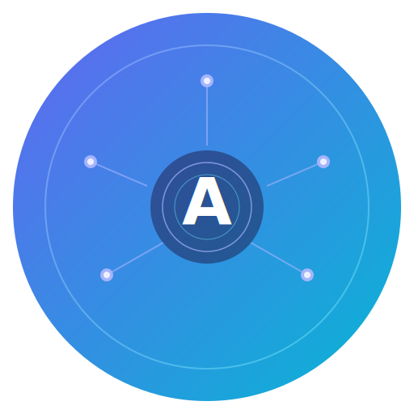

<div align="center">
  
  <h1>Anima</h1>
  <p><em>Make Every Hardware Intelligent — An open-source Agent OS that breathes AI into every device you own.</em></p>

  [English](./README.md) | [中文](./README.zh-CN.md)
  <br/><br/>

  [](https://opensource.org/licenses/MIT)
  
  
  
  
  
</div>
<br/>

**Anima** (Latin for "soul") is an open-source Agent OS that auto-discovers your hardware devices, equips each one with AI Skills, and lets them autonomously sense, decide, and collaborate — without requiring any manual configuration.


---

## Why Anima?

<div align="center">


</div>

> [!TIP]
> Most smart home systems ask *"what sensors do you need?"*. Anima asks **"what do you have — I'll use it."** It discovers your devices, loads domain knowledge for each one, and starts making intelligent decisions from day one.

<details>
<summary><strong>Q: Does it require manual device configuration?</strong></summary>

**A:** No. Anima auto-discovers devices on your local network via mDNS. For Xiaomi/Mi Home devices, a single QR scan fetches all tokens automatically — no IP lists, no manual token extraction.

</details>

<details>
<summary><strong>Q: Is it just a fancy on/off toggle?</strong></summary>

**A:** Far from it. Each device type gets a dedicated **Skill** — a domain knowledge package that includes comfort models, occupancy awareness, cross-device coordination rules, and preference learning. Your humidifier knows about seasonal adjustments and AC interactions; your lights follow circadian rhythms automatically.

</details>

<details>
<summary><strong>Q: How does it learn my preferences?</strong></summary>

**A:** Anima maintains a memory system with `preferences.md`, normalized learned profiles per device type, and extracted topic memories. The Brain incrementally extracts preferences from your interaction history and evolves its behavior over time.

</details>

<details>
<summary><strong>Q: Which LLM providers are supported?</strong></summary>

**A:** Any OpenAI-compatible API — including OpenAI, DeepSeek, Doubao, Anthropic (via proxy), and local Ollama models. Just set `ANIMA_LLM_API_KEY` and optionally `ANIMA_LLM_BASE_URL`.

</details>

---

## 60-Second Quick Start

```bash
# Clone the repo
git clone https://github.com/fulai-tech/Anima.git
cd Anima

# Install all dependencies (frontend + backend in one command)
pnpm install

# Configure
cp .env.example .env      # Fill in ANIMA_LLM_API_KEY

# Launch everything (MQTT Broker + Dashboard + Backend)
pnpm dev
```

Open **http://localhost:3000** to see the Anima Dashboard.

### Connect Your Devices

1. Click **Settings** (top-right gear icon)
2. In **LLM Brain**, enter your API Key and model (or configure via `.env`)
3. In **Xiaomi**, click **Generate QR Code**
4. Open **Mi Home** on your phone and scan the QR code
5. Done — all devices and tokens are fetched automatically

> **Why QR scan?** Tokens are stored on Xiaomi's cloud servers. Local scanning finds devices but cannot retrieve tokens. QR login is the most reliable approach — no password, no captcha.

Click **Help** (top-right) for a full in-Dashboard guide.

### Prerequisites

- [Node.js](https://nodejs.org/) >= 18 + [pnpm](https://pnpm.io/) >= 8
- [uv](https://docs.astral.sh/uv/) — Python package manager (auto-installed via `pnpm install`)

---

## Core Architecture

Anima runs as a **single asyncio process** connected to a lightweight MQTT broker:


---

## System Overview


---

## Event-Driven Architecture

The **EventBus** is the nervous system of Anima — all modules communicate through it via publish/subscribe, with error isolation per subscriber.


---

## Skill Decision Flow

When a sensor event or user chat arrives, the LLM Brain loads domain knowledge, plans actions via LangGraph, executes skills, verifies device state, and updates learned profiles.


---

## Device Communication Flow

Commands flow from the Dashboard through FastAPI to the MQTT broker, then through device adapters (MIoT / Matter) to physical devices. Discovery happens via mDNS or Xiaomi QR login.


---

## Skill Ecosystem

Each device type has a dedicated **Skill** — a domain knowledge package that teaches Anima how to make intelligent decisions. Skills are layered: System Skills (built-in) on the left, Custom Skills (user-created) on the right.


---

## What's Included

| Module | Description |
|--------|-------------|
| **Dashboard** | React + Vite + Tailwind — device list, environment view, AI decision stream, unified chat, settings, and memory debugger |
| **LLM Brain** | Skill-driven LangGraph planner/executor — plans actions, executes skills, verifies device state, serves `/api/chat` |
| **Skill System** | Per-device domain knowledge packages + user-extensible custom skills |
| **Memory System** | `preferences.md` + topic memories + normalized `learned.json` profiles with incremental extraction |
| **EventBus** | Async event system with wildcard subscriptions and error isolation |
| **Discovery** | Auto-scans via mDNS, registers devices, deduplicates |
| **MIoT Adapter** | Xiaomi/Mi Home device discovery and control via python-miio |
| **Scheduler** | Periodic scanning, preference learning, memory extraction, and brain ticks |
| **REST API** | FastAPI on port 8080 — devices, chat, settings, environment, memory-debug endpoints |
| **CLI** | Interactive Rich terminal: `devices`, `scan`, `status <id>`, `history` |

---

## Built-in Skills

Each Skill is a **domain knowledge package** — not just an API wrapper. It teaches Anima *how* to make intelligent decisions for that device type:

| Skill | Knowledge Includes |
|-------|-------------------|
| **Humidifier** | Comfort ranges (40-60%), seasonal adjustments, AC interaction, water level alerts |
| **Air Conditioner** | Energy optimization, circadian temperature scheduling, humidity coordination |
| **Light** | Circadian lighting (2200K-5000K), time-of-day brightness curves, transition smoothness |
| **Air Purifier** | Occupancy-aware purification, sleep-time quietness, air quality heuristics |
| **Speaker** | Explicit playback-oriented behavior, quiet-hour protection, safe no-op defaults |
| **Coordinator** | Cross-device orchestration — prevents conflicts, creates synergies |
| **Device Discovery** | Xiaomi QR onboarding, local scan helpers, activation flows |
| **Skill Creator** | Analysis-first custom skill generation and auto-generated system skills |

### Creating Custom Skills

Drop your skill into `skills/custom/<your-skill>/` following the template:

```
skills/
  system/               # Built-in skills maintained by Anima
    humidifier/
      SKILL.md          # Skill manifest + behavior spec
      references/
        knowledge.md
        decide.md
        learn.md
      scripts/
        actions.py
  custom/               # Your skills live here
    <your-skill>/
      SKILL.md
      references/
      scripts/
```

Global planner policy can also be tuned in [`core/brain/prompts/planner_hints.md`](./core/brain/prompts/planner_hints.md).

---

## Configuration

```env
# Required: any OpenAI-compatible API key
ANIMA_LLM_API_KEY=sk-xxx

# Optional: model name (default: gpt-4o)
ANIMA_LLM_MODEL=gpt-4o

# Optional: custom endpoint for DeepSeek / Doubao / Ollama / etc.
ANIMA_LLM_BASE_URL=https://api.deepseek.com/v1

# Optional: disable deep thinking (required for Doubao)
ANIMA_LLM_DISABLE_THINKING=false
```

**Supported LLM Providers** (any OpenAI-compatible API):

| Provider | `ANIMA_LLM_MODEL` | `ANIMA_LLM_BASE_URL` |
|----------|-------------------|----------------------|
| OpenAI | `gpt-4o` | *(leave empty)* |
| Anthropic (via proxy) | `claude-sonnet-4-20250514` | your proxy URL |
| DeepSeek | `deepseek-chat` | `https://api.deepseek.com/v1` |
| Doubao | `doubao-seed-2-0-lite-260215` | `https://ark.cn-beijing.volces.com/api/v3` |
| Ollama (local) | `llama3` | `http://localhost:11434/v1` |

---

## Development

| Command | Description |
|---------|-------------|
| `pnpm install` | Install all dependencies (frontend + backend) |
| `pnpm dev` | Start Dashboard (port 3000) + Backend (port 8080) together |
| `pnpm dev:frontend` | Start Dashboard only |
| `pnpm dev:backend` | Start Python backend only |
| `pnpm build` | Build Dashboard for production |
| `uv run pytest tests/ -v` | Run the full test suite |

FastAPI Swagger docs: `http://localhost:8080/docs`

---

## REST API

<details>
<summary><strong>View all endpoints</strong></summary>

| Method | Endpoint | Description |
|--------|----------|-------------|
| GET | `/health` | Health check |
| GET | `/api/devices` | List all discovered devices |
| GET | `/api/devices/{device_id}` | Get device details |
| POST | `/api/devices/{device_id}/command` | Send command to a device |
| POST | `/api/devices/add` | Add a manual MIoT device by IP + token |
| POST | `/api/devices/{device_id}/activate` | Activate a discovered device with a token |
| GET | `/api/rooms` | List rooms |
| POST | `/api/chat` | Unified graph-based chat (reply, system ops, skill execution) |
| GET | `/api/decisions` | Recent AI decision history |
| GET | `/api/environment` | Aggregated environment snapshot |
| POST | `/api/environment/refresh` | Refresh device states |
| POST | `/api/scan` | Trigger device re-scan |
| GET | `/api/memory` | View learned profiles, topic memories, extraction state, history |
| GET | `/api/settings` | Read persisted dashboard settings |
| GET | `/api/settings/xiaomi/status` | Xiaomi cloud connection status |
| POST | `/api/settings/xiaomi/qr/start` | Start Xiaomi QR login flow |
| POST | `/api/settings/xiaomi/qr/poll` | Poll Xiaomi QR login status |
| POST | `/api/settings/xiaomi/disconnect` | Clear Xiaomi cloud connection |
| GET | `/api/settings/llm/status` | Read current LLM configuration |
| POST | `/api/settings/llm/configure` | Save LLM configuration |

</details>

---

## Project Structure

```
Anima/
├── dashboard/                  # Frontend (React + Vite + Tailwind)
│   └── src/components/         # DeviceList, DeviceCard, DecisionLog, ChatBar, Header
├── core/                       # Python backend
│   ├── brain/                  # LLM decision engine + Skill loader
│   ├── events/                 # Async EventBus
│   ├── rules/                  # Fast-path rules engine
│   ├── memory/                 # User memory (markdown + JSON)
│   ├── scheduler/              # Periodic job scheduler
│   ├── api/                    # FastAPI REST endpoints
│   └── main.py                 # Main entrypoint
├── adapters/                   # Device protocol adapters
│   └── miot/                   # Xiaomi MIoT adapter
├── skills/
│   ├── system/                 # Built-in skills shipped with Anima
│   └── custom/                 # User-created skills
├── tests/                      # Automated test suite
├── docs/plans/                 # Design doc + implementation plan
├── package.json                # pnpm monorepo root
├── pyproject.toml              # Python dependencies
├── docker-compose.yml          # MQTT broker + core
└── .env.example                # Configuration template
```

---

## Roadmap

| Version | Milestone | Key Features |
|---------|-----------|-------------|
| **v0.1** | "It's Alive" (done) | Core framework, MIoT adapter, Dashboard, LangGraph brain, memory learning, CLI + API, Docker |
| v0.2 | "Getting Smarter" | Matter adapter, real-time WebSocket, preference learning, room management |
| v0.3 | "Community Arrives" | Skill Store, adapter plugins, Telegram Bot, HA bridge |
| v0.4 | "Getting Stronger" | Multi-user, Raspberry Pi image, security hardening |

---

## Contributing

Anima is designed for easy contribution:

- **Write a Skill** — create a new folder under `skills/custom/` with `SKILL.md`, `references/`, and optional `scripts/`. Copy from `skills/custom/_template/` to get started.
- **Write an Adapter** — 1 class, 3 methods: `discover()`, `subscribe()`, `execute()`

See the [Design Document](docs/plans/2026-03-17-anima-design.md) for full architecture details.

---

## License

[Apache 2.0](https://www.apache.org/licenses/LICENSE-2.0)

<div align="center">
  <br/>
  <i>Made with love by the Anima Team</i>
</div>
