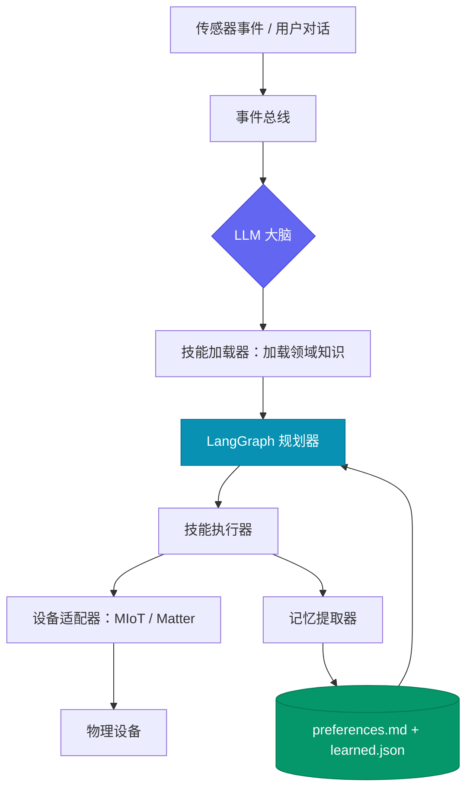

<div align="center">
  
  <h1>Anima</h1>
  <p><em>让每一件硬件都拥有智能 — 为你所有设备注入 AI 灵魂的开源 Agent OS。</em></p>

  [English](./README.md) | [中文](./README.zh-CN.md)
  <br/><br/>

  [](https://opensource.org/licenses/MIT)
  
  
  
  
  
</div>

<br/>

**Anima**（拉丁语，意为"灵魂"）是一个开源的 Agent OS，自动发现你的硬件设备，为每一台设备赋予 AI 技能，使它们能够自主感知、决策与协作——无需任何手动配置。

## 核心亮点
1. 自主感知与智能生成：系统可主动发现局域网内智能设备，基于设备特征与专业知识自动生成执行 Skill，实现状态感知、能力接入与行为序列管理，实现全局自驱动。 
2. 事件驱动与统一调度：通过事件总线与定时任务统一调度，系统具备敏捷响应关键事件的能力，实现端到端自动化控制与智能调度。 
3. Brain 中枢自适应决策与演化：中枢模块整合记忆演化、策略优化与自我学习，实现系统从被动执行到主动服务的智能跃迁，打造真正的智能管家级体验。 
## 记忆管理
1. 分层存储，高效检索：多层 Memory 架构兼顾长期留存、快速检索与上下文可控，构建高效知识管理体系。 
2. 按需加载，精确推理：记忆按设备或场景拆分，仅加载当前上下文，防止信息膨胀，同时显著提升推理效率。 
3. 类人“做梦”，自我优化：后台持续提取、压缩与重组记忆，实现不中断运行的长期自我演化，赋能系统持续进化。 
## Skill 管理
1. 模块化与标准化：Skill 架构涵盖知识、决策、学习与动作执行，全面解耦，实现系统统一、可扩展与可复用。 
2. 自扩展 Skill Creator：面向自然语言交互或新设备接入，系统自动生成补充 Skill，实现能力边界的动态拓展。 
3. 自进化智能 Skill：基于记忆学习用户偏好，动态优化行为策略，使设备呈现类人化、可持续进化的智能行为。 

---

## 💡 为什么选择 Anima？

<div align="center">


</div>

> [!TIP]
> 大多数智能家居系统问的是"你需要什么传感器？"Anima 问的是 **"你有什么——我来用。"** 它自动发现你的设备，为每台设备加载领域知识，从第一天起就开始做智能决策。

<details>
<summary><strong>Q：需要手动配置设备吗？</strong></summary>

**A：** 不需要。Anima 通过 mDNS 自动扫描局域网发现设备。对于小米/米家设备，一次扫码即可自动获取所有 Token——无需手动填写 IP 列表或提取 Token。

</details>

<details>
<summary><strong>Q：它只是个花哨的开关控制器吗？</strong></summary>

**A：** 远不止如此。每种设备类型都有专属的 **技能（Skill）**——一个包含舒适度模型、占用感知、跨设备协调规则和偏好学习的领域知识包。你的加湿器了解季节调整和空调联动；你的灯光会自动遵循昼夜节律。

</details>

<details>
<summary><strong>Q：它怎么学习我的偏好？</strong></summary>

**A：** Anima 维护着一套包含 `preferences.md`、各设备类型规范化 learned profile 和提取 topic memories 的记忆系统。Brain 会从你的交互历史中增量提取偏好，并随时间演进行为。

</details>

<details>
<summary><strong>Q：支持哪些 LLM 提供商？</strong></summary>

**A：** 任何兼容 OpenAI API 的服务——包括 OpenAI、DeepSeek、豆包、Anthropic（通过代理）以及本地 Ollama 模型。只需设置 `ANIMA_LLM_API_KEY`，可选设置 `ANIMA_LLM_BASE_URL`。

</details>

---

## 🚀 60 秒跑起来

```bash
# 克隆并进入项目
git clone https://github.com/fulai-tech/Anima.git
cd Anima

# 安装依赖（前后端一条命令搞定）
pnpm install

# 配置
cp .env.example .env      # 填入 ANIMA_LLM_API_KEY

# 启动（MQTT Broker + 控制面板 + 后端同时启动）
pnpm dev
```

打开 **http://localhost:3000** —— 你会看到 Anima 控制面板。

### 连接你的设备

1. 点击右上角 **⚙ 设置**（齿轮图标）
2. 在「LLM 大脑」区域填入 API Key 和模型配置（也可用 .env 文件配置）
3. 在「小米/米家」区域点击 **生成二维码**
4. 打开手机 **米家 APP**，扫描页面上的二维码
5. 完成 — 所有小米设备和 Token 自动获取

> **为什么需要扫码？** Token 是设备的控制密钥，存储在小米云服务器上。局域网扫描能发现设备，但拿不到 Token。扫码登录是最可靠的认证方式——不需要输密码，不会被风控拦截。

点击右上角 **? 帮助** 按钮可在 Dashboard 内查看完整操作指南。

### 前置依赖

- [Node.js](https://nodejs.org/) >= 18 + [pnpm](https://pnpm.io/) >= 8
- [uv](https://docs.astral.sh/uv/)（Python 包管理器，`pnpm install` 时自动安装后端依赖）

---

## 🧠 核心架构

Anima 以**单一 asyncio 进程**运行，连接轻量级 MQTT Broker：

```
┌───────────────────────────────────────────┐
│              核心（单进程）                  │
│                                           │
│  发现服务 ──▶ 事件总线 ◀── 调度器           │
│                   │                       │
│  传感器 / 对话 ──▶ LLM 大脑 ◀── 记忆体      │
│                   │                       │
│       控制面板 · 聊天 API · MQTT 客户端     │
└──────────────────┬────────────────────────┘
                   │ MQTT
            ┌──────┴──────┐
            │  Mosquitto  │
            └──┬─────┬────┘
           MIoT    Matter   HA 桥接
          适配器   适配器   (v0.2+)
```



---

## ✨ 包含什么

| 模块 | 说明 |
|------|------|
| **控制面板** | React + Vite + Tailwind —— 设备列表、环境视图、AI 决策流、统一对话、设置与记忆调试面板 |
| **LLM 大脑** | 基于 LangGraph 的技能规划/执行引擎——规划动作、执行 skill、校验设备状态，统一承接 `/api/chat` |
| **技能系统** | 每设备类型领域知识包 + 用户可扩展的自定义 skill |
| **记忆系统** | `preferences.md` + topic memories + 规范化 `learned.json`，带增量提取 |
| **事件总线** | 异步事件系统，支持通配符订阅和错误隔离 |
| **发现服务** | 通过 mDNS 自动扫描局域网，注册设备，自动去重 |
| **MIoT 适配器** | 小米/米家设备发现和控制（基于 python-miio） |
| **调度器** | 周期性设备扫描、偏好学习、记忆提取、brain tick |
| **REST API** | FastAPI 服务，端口 8080 |
| **CLI** | Rich 交互式终端：`devices`、`scan`、`status <id>`、`history` |

---

## 🎯 内置技能

每个技能是一个**领域知识包**——而非简单的 API 封装。它教会 Anima 如何为该类型设备做出智能决策：

| 技能 | 知识库包含 |
|------|-----------|
| **加湿器** | 舒适湿度范围（40–60%）、季节调整、空调联动、水位预警 |
| **空调** | 能耗优化、昼夜温度节律、湿度协调 |
| **灯光** | 昼夜节律照明（2200K–5000K）、分时亮度曲线、渐变过渡 |
| **空气净化器** | 基于占用/睡眠时段的净化策略、空气质量启发式 |
| **音箱** | 显式播放优先、静音时段保护、安全 no-op |
| **协调者** | 跨设备编排——防止冲突、创造协同 |
| **设备发现** | 小米扫码引导、局域网扫描、设备激活流程 |
| **Skill Creator** | 先分析 workflow 再生成 skill，并可自动补齐 system skill |

### 创建自定义技能

将你的技能放入 `skills/custom/<your-skill>/`，参考以下模板结构：

```
skills/
  system/               # Anima 自带内置 skill
    humidifier/
      SKILL.md          # 技能描述与行为规范
      references/
        knowledge.md
        decide.md
        learn.md
      scripts/
        actions.py
  custom/               # 你的 skill 放这里
    <your-skill>/
      SKILL.md
      references/
      scripts/
```

全局 planner 策略也可在 [`core/brain/prompts/planner_hints.md`](./core/brain/prompts/planner_hints.md) 中调整。

---

## ⚙️ 配置说明

```env
# 必填：任何兼容 OpenAI 格式的 API Key
ANIMA_LLM_API_KEY=sk-xxx

# 可选：模型名称（默认 gpt-4o）
ANIMA_LLM_MODEL=gpt-4o

# 可选：自定义 API 端点（DeepSeek / 豆包 / Ollama 等）
ANIMA_LLM_BASE_URL=https://api.deepseek.com/v1

# 可选：关闭深度思考（豆包必须开启此项）
ANIMA_LLM_DISABLE_THINKING=false
```

**支持的 LLM 提供商**（任何兼容 OpenAI API 的服务）：

| 提供商 | `ANIMA_LLM_MODEL` | `ANIMA_LLM_BASE_URL` |
|--------|-----------------|---------------------|
| OpenAI | `gpt-4o` | *（留空）* |
| Anthropic（通过代理） | `claude-sonnet-4-20250514` | 你的代理地址 |
| DeepSeek | `deepseek-chat` | `https://api.deepseek.com/v1` |
| 豆包 | `doubao-seed-2-0-lite-260215` | `https://ark.cn-beijing.volces.com/api/v3` |
| Ollama（本地） | `llama3` | `http://localhost:11434/v1` |

---

## 🛠️ 开发命令

| 命令 | 说明 |
|------|------|
| `pnpm install` | 安装所有依赖（前端 + 后端） |
| `pnpm dev` | 同时启动控制面板（3000）+ 后端（8080） |
| `pnpm dev:frontend` | 仅启动控制面板 |
| `pnpm dev:backend` | 仅启动 Python 后端 |
| `pnpm build` | 构建控制面板生产版本 |
| `uv run pytest tests/ -v` | 运行全部自动化测试 |

后端以 full 模式运行时，可在 `http://localhost:8080/docs` 查看 FastAPI Swagger 文档。

---

## 📡 REST API

<details>
<summary><strong>查看所有接口</strong></summary>

| 方法 | 端点 | 说明 |
|------|------|------|
| GET | `/health` | 健康检查 |
| GET | `/api/devices` | 列出所有已发现的设备 |
| GET | `/api/devices/{device_id}` | 获取设备详情 |
| POST | `/api/devices/{device_id}/command` | 向设备发送控制命令 |
| POST | `/api/devices/add` | 用 IP + Token 手动添加 MIoT 设备 |
| POST | `/api/devices/{device_id}/activate` | 为已发现设备补充 Token 激活 |
| GET | `/api/rooms` | 列出房间 |
| POST | `/api/chat` | 统一 graph 对话入口，可回复、执行系统操作或触发 skill |
| GET | `/api/decisions` | 最近的 AI 决策历史 |
| GET | `/api/environment` | 聚合环境快照 |
| POST | `/api/environment/refresh` | 刷新设备状态并返回最新环境 |
| POST | `/api/scan` | 触发设备重新扫描 |
| GET | `/api/memory` | 查看规范化 learned profile、topic memories、提取状态与最近历史 |
| GET | `/api/settings` | 读取控制面板配置 |
| GET | `/api/settings/xiaomi/status` | 小米云连接状态 |
| POST | `/api/settings/xiaomi/qr/start` | 启动小米扫码登录 |
| POST | `/api/settings/xiaomi/qr/poll` | 轮询扫码登录状态 |
| POST | `/api/settings/xiaomi/disconnect` | 断开小米云连接 |
| GET | `/api/settings/llm/status` | 读取当前 LLM 配置状态 |
| POST | `/api/settings/llm/configure` | 保存 LLM 配置 |

</details>

---

## 📁 项目结构

```
Anima/
├── dashboard/                  # 前端（React + Vite + Tailwind）
│   └── src/components/         # DeviceList, DeviceCard, DecisionLog, ChatBar, Header
├── core/                       # Python 后端
│   ├── brain/                  # LLM 决策引擎 + 技能加载器
│   ├── events/                 # 异步事件总线
│   ├── rules/                  # 快速通道规则引擎
│   ├── memory/                 # 用户记忆（Markdown + JSON）
│   ├── scheduler/              # 周期任务调度器
│   ├── api/                    # FastAPI REST 接口
│   └── main.py                 # 主入口
├── adapters/                   # 设备协议适配器
│   └── miot/                   # 小米 MIoT 适配器
├── skills/
│   ├── system/                 # Anima 内置 skill
│   └── custom/                 # 用户自定义 skill
├── tests/                      # 自动化测试套件
├── docs/plans/                 # 设计文档 + 实施计划
├── package.json                # pnpm monorepo 根配置
├── pyproject.toml              # Python 依赖
├── docker-compose.yml          # MQTT Broker + 核心
└── .env.example                # 配置模板
```

---

## 🗺️ 路线图

| 版本 | 里程碑 | 主要功能 |
|------|--------|---------|
| **v0.1** | "它活了" ✅ | 核心框架、MIoT 适配器、控制面板、LangGraph Brain、记忆学习、CLI + API、Docker |
| v0.2 | "越来越聪明" | Matter 适配器、实时 WebSocket、偏好学习、房间管理 |
| v0.3 | "社区来了" | 技能商店、适配器插件、Telegram Bot、HA 桥接 |
| v0.4 | "越来越强" | 多用户、树莓派镜像、安全加固 |

---

## 🤝 参与贡献

Anima 的设计让贡献变得简单：

- **编写技能** — 在 `skills/custom/` 下新建目录，至少包含 `SKILL.md` 和 `references/`。从 `skills/custom/_template/` 复制模板开始即可。
- **编写适配器** — 1 个类、3 个方法：`discover()`、`subscribe()`、`execute()`

详见[设计文档](docs/plans/2026-03-17-anima-design.zh-CN.md)。

---

## 📝 许可证

[Apache 2.0](https://www.apache.org/licenses/LICENSE-2.0)

<div align="center">
  <br/>
  <i>Made with ❤️ by the Anima Team</i>
</div>
